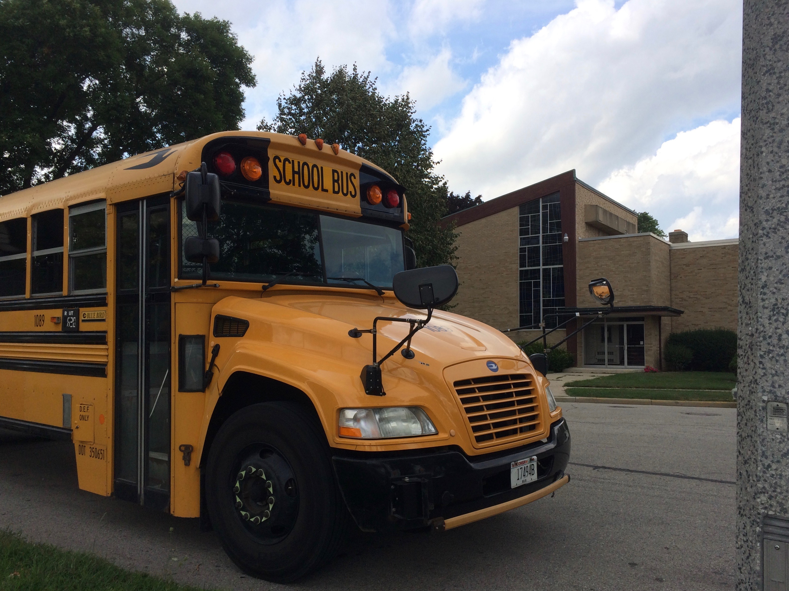

```{r setup, include=FALSE}
knitr::opts_chunk$set(echo = FALSE)
```

Jetzt habe ich die ersten zwei Wochen Schule geschafft. Wie ich vorher schon einmal beschrieben habe, gehe ich zur Milwaukee School of Languages, eine Schule ca. 6 Meilen südlich von dem Haus in dem ich lebe. Was man grundsätzlich zu dem Schulsystem und der Schule selbst sagen kann: es ist Schule, aber eindeutig anders als in Deutschland. Ich habe jeden Tag den selben Stundenplan. Momentan startet mein Tag damit, dass ich um 7:50 Uhr aus dem Haus gehe, um den Schulbus zu erwischen, der aber quasi direkt vor der Haustür hält. Dann fahre ich etwa eine halbe Stunde mit dem Bus, bis wir dann an der Schule ankommen.

```{r, preview = TRUE, fig.cap= "Die berühmten Schulbusse; [Quelle: privat]"}

```

Dort geht der Unterricht dann um 8:40 Uhr los. In der ersten Stunde habe ich Study Hall, einfach eine Stunde in der ich Hausaufgaben oder ähnliches machen kann. Danach habe ich dann vier Minuten Zeit, um den Klassenraum zu wechseln und zu Englisch bei Ms. Laufenberg zu kommen. Dieser Unterricht ist ungefähr wie der Deutschunterricht in Deutschland, nur auf Englisch. Danach habe ich dann Geometry bei Ms. He, was in Deutschland dem Matheunterricht entspricht, sich aber nur mit Geometrie befasst und nicht mit Funktionen oder ähnlichem. In dem Kurs, in dem ich bin, sind Freshman und Sophomores, wir behandeln aber Stoff, den wir schon vor zwei Jahren gemacht haben. Daher versuche ich, diesen Kurs noch beim Guidance Counselor, dem zuständigen für Stundenplanänderungen. In der vierten Stunde habe ich dann Sport. Dieser unterscheidet sich dann doch vom Sport bei uns an der Schule. Die Sporthalle ist mitten in der Schule, und in ihr gibt es einerseits eine „normale“ Sporthalle für Basketball, Volleyball etc., aber auch einen Kraftraum im Hinterraum. Ich habe in diesem Kraftraum bei Mr. Kraner Unterricht, daher kann ich über den Unterricht in der Halle nicht viel sagen. Wir haben verschiedene Übungen an den Geräten für alle Muskelgruppen gezeigt bekommen, und sollen jetzt in der nächsten Woche unseren eigenen Trainingsplan zusammenstellen. Nach dem Sport habe ich dann Chemie bei Mr. Tao. Er ist ein Amerikaner chinesischer Herkunft, und es ist ziemlich schwierig ihn zu verstehen. Außerdem haben die hier gerade erst mit Chemie angefangen, so weiß ich also das meiste schon, es fehlt mir nur ein bisschen an Vokabular. Daher ist dieser Unterricht ein bisschen langweilig. Danach kommt dann Lunch. Das Essen in der Cafeteria der Schule ist für alle umsonst, es ist geschmacksmäßig nicht immer sonderlich gut, aber eindeutig in Ordnung. Inzwischen habe ich auch schon ein paar Leute gefunden, neben die ich mich beim Lunch setzen kann und mit denen ich mich unterhalten kann :-).  Nach dem Lunch, das ungefähr eine halbe Schulstunde dauert, gehen wir dann zu unserem Homeroom. Dort können wir den Rest der Stunde irgendetwas machen, im Moment haben wir da öfter Uno gespielt. Danach habe ich dann World History, was sich in sofern von Geschichte in Deutschland unterscheidet, dass wir dort nach Arbeitsblätter und Aufsätzen, die wir schreiben, bewertet werden und nicht nach mündlicher Mitarbeit. Als letzte Stunde am Tag habe ich dann German Literature, da ich irgendeine „Fremdsprache“ belegen musste. Es ist ein bisschen lustig, wenn man Amerikaner Deutsch reden hört, aber da alle in diesem Kurs schon seit der ersten Klasse die Sprache lernen, ist ihr Deutsch ziemlich gut. Danach fahre ich dann wieder mit dem Bus nach Hause, und komme dann so gegen halb fünf zuhause an. Ich wollte auch wieder mit dem Schwimmen weitermachen, das startet dann am 09. September an der Riverside High School. Soviel jetzt erstmal zu meiner Schule und meinem aktuellen Stand hier, ich melde mich wieder :-)
