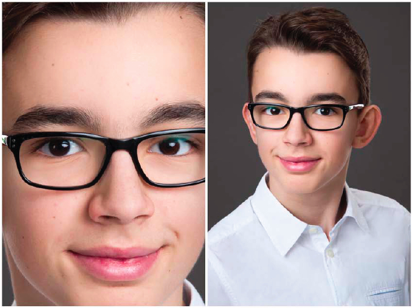

```{r setup, include=FALSE}
knitr::opts_chunk$set(echo = FALSE)


```
```{r, fig.cap= "Das bin ich; [Quelle: privat]"}

```
# Über mich

Mein Name ist Jonas Friederichs, ich bin im September 2004 geboren und gehe nun, in der 10. Klasse, mit Experiment e.V. für ein halbes Jahr in die USA. Ich möchte dort einerseits gerne mein Englisch verbessern und eine andere Kultur kennenlernen, andererseits habe ich schon oft gehört, dass Teilnehmer aus vorherigen Jahren dort viele Erfahrungen für ihr Leben gesammelt haben.

# About me

My name is Jonas Friederichs, I was born in September 2004 and now, as I am in the 10th grade, I go to the US for half a year. There I want to enhace my language skills and get to know a different culture. I often heard of other friends who did another exchange year that they have collected lots of experiences for their life. 
